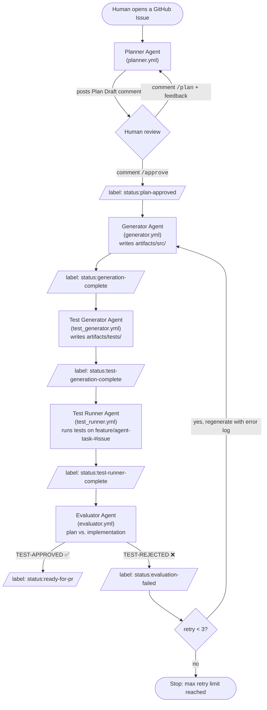

# AI Agent Workflow System

An AI-driven multi-agent workflow system for automated software engineering tasks.

This project implements a Planner → Generator → Test Generator → Test Runner → Evaluator workflow using independent AI agents and GitHub Actions automation.

---

# Project Overview

The system is designed around a modular agent architecture:

* **Planner Agent**
  Creates implementation plans and task breakdowns.

* **Generator Agent**
  Generates source code and related artifacts.

* **Test Generator Agent**
  Writes unit tests for the generated code.

* **Test Runner Agent**
  Executes the generated tests on the feature branch.

* **Evaluator Agent**
  Validates generated code against the approved plan and test results. On rejection, it re-triggers the Generator with the error log (self-healing loop, max 3 retries).

The workflow is orchestrated through GitHub Actions pipelines.

---

# Directory Structure

```text
.
├── .github/
│   └── workflows/      # CI/CD pipelines for individual agent execution
├── agents/             # Core logic for the autonomous agents
│   ├── skills/         # Reusable tools and capabilities for agents
│   ├── evaluator.py        # Validates generated code against the plan
│   ├── generator.py        # Writes the actual source code
│   ├── planner.py          # Breaks down user prompts into actionable steps
│   ├── test_generator.py   # Writes unit tests for the generated code
│   └── test_runner.py      # Executes the generated tests
├── artifacts/          # The output directory for generated software
│   ├── src/            # Generated source code (e.g., converter.py)
│   └── tests/          # Generated unit tests (e.g., test_converter.py)
├── config/             # System and agent configuration files
├── sandbox/            # Isolated environment for safely executing code
├── README.md           # Project documentation
└── requirements.txt    # Python dependencies
```

---

# Components

## `agents/`

Contains the core AI agent implementations.

| File                | Description                                          |
| ------------------- | ---------------------------------------------------- |
| `planner.py`        | Generates execution plans                            |
| `generator.py`      | Produces implementation code                         |
| `test_generator.py` | Writes unit tests for the generated code             |
| `test_runner.py`    | Executes the generated tests                         |
| `evaluator.py`      | Runs evaluation; re-triggers the Generator on reject |
| `skills/`           | Shared reusable agent capabilities                   |

---

## `artifacts/`

Stores generated outputs and evaluation artifacts.

Example:

```text
artifacts/
├── src/
└── tests/
```

Typical contents:

* Generated source code
* Test cases
* Evaluation results
* Debug outputs

---

## `.github/workflows/`

GitHub Actions automation workflows.

| Workflow             | Purpose                            |
| -------------------- | ---------------------------------- |
| `planner.yml`        | Executes planning stage            |
| `generator.yml`      | Executes code generation           |
| `test_generator.yml` | Executes test generation           |
| `test_runner.yml`    | Executes generated tests           |
| `evaluator.yml`      | Executes validation/testing        |
| `build-image.yml`    | Builds the agent-runner/DB images  |

---

## `sandbox/`

Temporary execution environment for experiments, testing, and isolated runs.

---

## `config/`

Configuration files for:

* Models
* Runtime settings
* Environment variables
* Agent parameters

---

# Workflow Architecture

The agents run as independent GitHub Actions jobs, chained together by **issue labels** (each agent finishes by setting the label that wakes up the next one). Humans interact only at the planning stage, via issue comments (`/plan`, `/approve`).



Key mechanics:

* **Label-driven orchestration** — each workflow's `on: issues: [labeled]` trigger filters on the label set by the previous agent, so the pipeline needs no central orchestrator.
* **Human-in-the-loop planning** — the Planner iterates on the plan via `/plan <feedback>` comments until a human replies `/approve`.
* **Self-healing loop** — when the Evaluator rejects, `status:evaluation-failed` re-triggers the Generator with the original plan plus the rejection log, up to `AGENT_RETRY_LIMIT = 3` attempts.
* **Issue as shared memory** — agents exchange context (approved plan, generator summary, rejection logs) by reading/writing issue comments, each tagged with the agent's signature.

---

# Installation

## Requirements

* Python 3.11+
* Git
* GitHub Actions (optional)

---

## Setup

```bash
git clone <repository-url>
cd <project-name>

python -m venv venv
source venv/bin/activate

pip install -r requirements.txt
```

---

# License

MIT License
